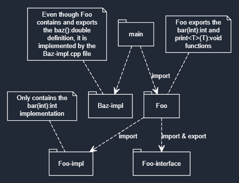

# C++20 Modules

<style>
section {
  display: grid;
  grid-template-columns: 1fr 1fr;
  gap: 15px;
}
</style>

- [C++20 Modules](#c20-modules)
  - [Hello World benchmarks](#hello-world-benchmarks)
    - [Without modules (main.cpp)](#without-modules-maincpp)
    - [With modules (main.m.cpp)](#with-modules-mainmcpp)
    - [Clang](#clang)
    - [GCC](#gcc)
  - [Precompiled headers vs Header units vs Modules](#precompiled-headers-vs-header-units-vs-modules)
    - [PCH](#pch)
    - [Header units](#header-units)
    - [Modules](#modules)
  - [Header unit use](#header-unit-use)
  - [Modules, module partitions and interfaces](#modules-module-partitions-and-interfaces)
  - [Problems and "Solutions"](#problems-and-solutions)
  - [Links](#links)

## Hello World benchmarks

<section>

### Without modules (main.cpp)

### With modules (main.m.cpp)

</section>
<section>

```cpp
#include <iostream>

int main() {
  std::cout << "Hello World\n";
  return EXIT_SUCCESS;
}
```

```cpp
import <iostream>;

int main() {
  std::cout << "Hello World\n";
  return EXIT_SUCCESS;
}
```

</section>

It's important to note, that `MSVC` has to import standard library modules using the `std.iostream` instead of the `<iostream>` syntax. This may or may not be a standard in the future.

### Clang

<section>

```sh
time clang++ -std=c++20 main.cpp
```

```sh
time clang++ -std=c++20 -fmodules -fbuiltin-module-map main.m.cpp
```

</section>
<section>

|      | time     |
| ---- | -------- |
| real | 0m0.882s |
| user | 0m0.555s |
| sys  | 0m0.254s |

|      | time     |
| ---- | -------- |
| real | 0m0.087s |
| user | 0m0.052s |
| sys  | 0m0.037s |
</section>

### GCC

In GCC standard headers have to be compiled into modules. Which takes time, but you only have to do it once.

```sh
g++ -std=c++20 -fmodules-ts -x c++-system-header iostream
```

|      | time     |
| ---- | -------- |
| real | 0m0.797s |
| user | 0m0.737s |
| sys  | 0m0.060s |

<section>

```sh
time g++ -std=c++20 main.cpp
```

```sh
time g++ -std=c++20 -fmodules-ts main.m.cpp
```

</section>
<section>

|      | time     |
| ---- | -------- |
| real | 0m0.772s |
| user | 0m0.427s |
| sys  | 0m0.094s |

|      | time     |
| ---- | -------- |
| real | 0m0.301s |
| user | 0m0.173s |
| sys  | 0m0.021s |
</section>

The usual speedup is 2-10x.

## Precompiled headers vs Header units vs Modules

### PCH

A precompiled header (PCH) improves compile time by creating a compiler memory snapshot of a set of header files. This is an improvement on repeatedly rebuilding header files.

PCH files have restrictions that make them difficult to maintain.

PCH files are faster than #include but slower than import.

### Header units

This is a new feature in C++20 that allows you to import 'well-behaved' header files as modules.

Header units are faster than #include, and are easier to maintain, significantly smaller, and also faster than pre-compiled header files (PCH).

Header units are an 'in-between' step meant to help transition to named modules in cases where you rely on macros defined in header files, since named modules don't expose macros.

Header units are slower than importing a named module.

Header units aren't affected by macro defines unless they're specified on the command line when the header unit is built--making them more robust than header files.

**Header units expose the macros** and internal implementation defined in them just as header file do, which named modules don't.

As a rough approximation of file size, a 250-megabyte PCH file might be represented by an 80-megabyte header unit file.

### Modules

This is the fastest and most robust way to import functionality.

Support for importing modules was introduced in C++20. The C++23 standard library introduces the two named modules described in this topic.

When you import std, you get the standard names such as std::vector, std::cout, but no extensions, no internal helpers such as _Sort_unchecked, and no macros.

The order of imports doesn't matter because there are no macro or other side-effects.

As a rough approximation of file size, a 250-megabyte PCH file might be represented by an 80-megabyte header unit file, which might be represented by a 25-megabyte module.

Named modules are faster because when a named module is compiled into an .ifc file and an .obj file, the compiler emits a structured representation of the source code that can be loaded quickly when the module is imported. The compiler can do some work (like name resolution) before emitting the .ifc file because of how named modules are order-independent and macro-independent--so this work doesn't have to be done when the module is imported. In contrast, when a header file is consumed with #include, its contents must be preprocessed and compiled again and again in every translation unit.

Precompiled headers, which are compiler memory snapshots, can mitigate those costs, but not as well as named modules.

## Header unit use

```sh
g++ -std=c++20 -fmodules-ts -fmodule-header -x c++-header Foo.hpp
```

```cpp
// use like a regular include
import "Foo.hpp";
```

At least that's how it should work, but they are buggy AF in GCC and Clang.

```txt
./Foo.hpp: error: failed to read compiled module: Bad file data
./Foo.hpp: note: compiled module file is 'gcm.cache/,/Foo.hpp.gcm'
./Foo.hpp: fatal error: returning to the gate for a mechanical issue
compilation terminated.
```

## Modules, module partitions and interfaces

<!-- TODO -->

[Link to source files](./src/module-partitions/)



## Problems and "Solutions"

- Intellisense/linters don't recognize imports.
  - This is only usable with header units:

```cpp
#ifdef __INTELLISENSE__
#include "foo.hpp"
#else
import "foo.hpp";
#endif
```

- Only MSVC supports header units (without major bugs)
  - Clang has better progress over GCC for header units, but modules tend to work well in both (except partitions).
  - But tooling like linters are non-existent for the import/export syntax unles we use Visual Studio.
- CMake doesn't support it and it probably won't for at least a year.
  - Fork CMake and implement it (doesn't sound viable)

## Links

- [2022 modules report](https://github.com/royjacobson/modules-report)
- [C++20 Modules Complete Guide](https://itnext.io/c-20-modules-complete-guide-ae741ddbae3d)
- [Header units under clang StackOverflow](https://stackoverflow.com/questions/67210597/how-to-compile-use-header-unit-modules-under-clang-c)
- [YouTube playlist](https://www.youtube.com/playlist?list=PLl-B9BMsZXYpHLhfenFjDUPXTvXzKKICK)
- [Microsoft modules comparison](https://learn.microsoft.com/en-us/cpp/build/compare-inclusion-methods?view=msvc-170)
- [Clang LLVM examples](https://clang.llvm.org/docs/StandardCPlusPlusModules.html)
